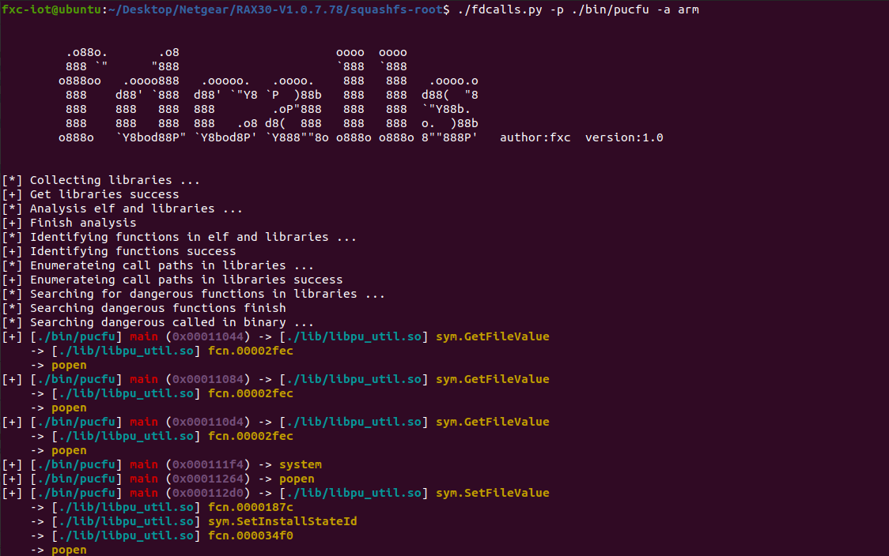

# fdcalls

**author: fxc**

## version

latest: v1.2

## introduction

**fdcalls** purpose is to help security researchers view dangerous function calls across files.

Due to my rushed writing time, there may be many bugs in it.

Welcome to provide suggestions.

## Usage

```shell
fdcalls -p [path/to/target_binary] -f [path/to/file_system_dir] -a [arch] -l [level=0]
```

## Setup

```shell
git clone https://github.com/fxc233/fdcalls
cd fdcalls
sudo python3 setup.py install
```

## results



## contact

FXC030618@outlook.com

## related articles

[https://www.cnblogs.com/pwnfeifei/p/17369551.html](https://www.cnblogs.com/pwnfeifei/p/17369551.html)
