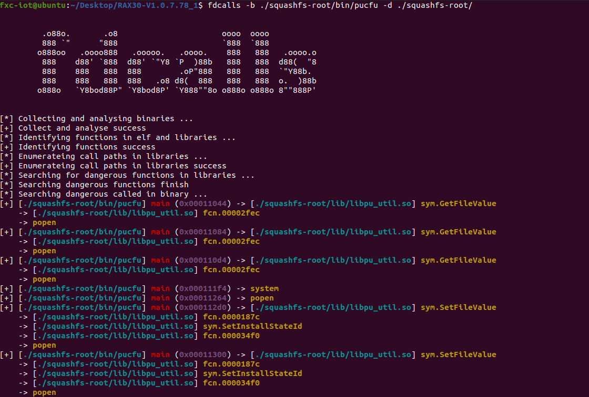

# fdcalls

author: fxc

## introduction

**fdcalls** purpose is to help security researchers view dangerous function calls across files.

Due to my rushed writing time, there may be many bugs in it.

Welcome to provide suggestions.

## Usage

```shell
./dcalls.py -p [relative/path/to/bin ] -a [arch]
```

## prerequisites

```shell
pip install r2pipe
```

## results


